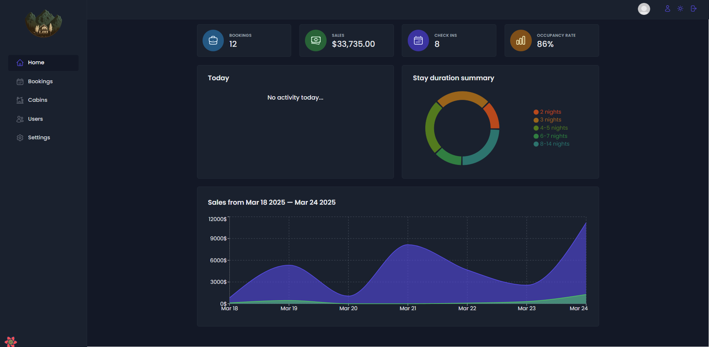

# Hotel Management System

A modern, full-stack hotel management application built with React and Supabase. This application helps hotel staff manage bookings, guests, and operations efficiently.




## 🌟 Features

- **User Authentication**
  - Secure login system
  - Role-based access control
  - Persistent sessions

- **Booking Management**
  - Create and manage hotel bookings
  - Real-time booking status updates
  - Guest information management

- **Dashboard & Analytics**
  - Interactive data visualizations
  - Key performance indicators (KPIs)
  - Booking statistics and trends

- **Guest Management**
  - Guest profile management
  - Booking history
  - Guest preferences tracking

- **Modern UI/UX**
  - Responsive design
  - Dark/Light mode support
  - Intuitive navigation
  - Toast notifications for user feedback

## 🛠️ Technologies Used

- **Frontend**
  - React 18
  - React Router 6
  - React Query
  - Styled Components
  - React Hook Form
  - Recharts for data visualization

- **Backend**
  - Supabase (PostgreSQL)
  - Supabase Authentication
  - Real-time database capabilities

- **Development Tools**
  - Vite
  - ESLint

## 🚀 Getting Started

### Prerequisites

- Node.js (v14 or higher)
- npm

### Installation

1. Clone the repository:
```bash
git clone https://github.com/ZoubairAntifi/hotel-management-system.git
```

2. Navigate to the project directory:
```bash
cd hotel-management-system
```

3. Install dependencies:
```bash
npm install
```

4. Insert your supabase URL and API key in the ./src/services/supabase.js file
```
export const supabaseUrl = "***";
const supabaseKey ="****";
const supabase = createClient(supabaseUrl, supabaseKey);
```

5. Start the development server:
```bash
npm run dev
```

The application will be available at `http://localhost:5173`

## 📁 Project Structure

```
src/
├── components/     # Reusable UI components
├── context/       # React context providers
├── features/      # Feature-specific components and hooks
├── hooks/         # Custom React hooks
├── pages/         # Page components
├── services/      # API and external service integrations
├── styles/        # Global styles and theme
├── ui/            # UI components library
└── utils/         # Utility functions
```


## 🙏 Acknowledgments

This app was developed as part of the [Udemy course](https://www.udemy.com/course/the-ultimate-react-course) by **Jonas Schmedtmann**. Special thanks to Jonas for his excellent teaching and guidance throughout the course.